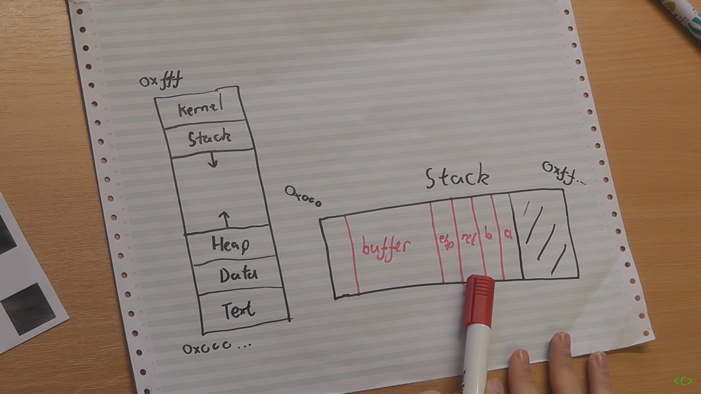
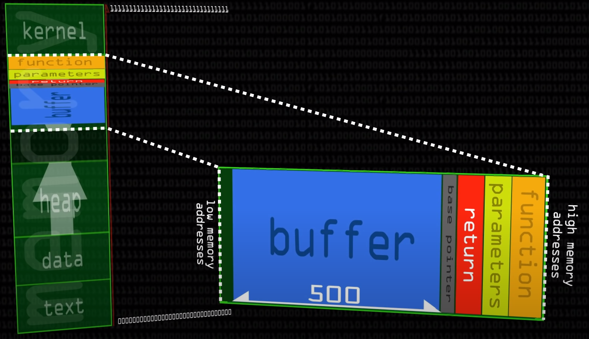
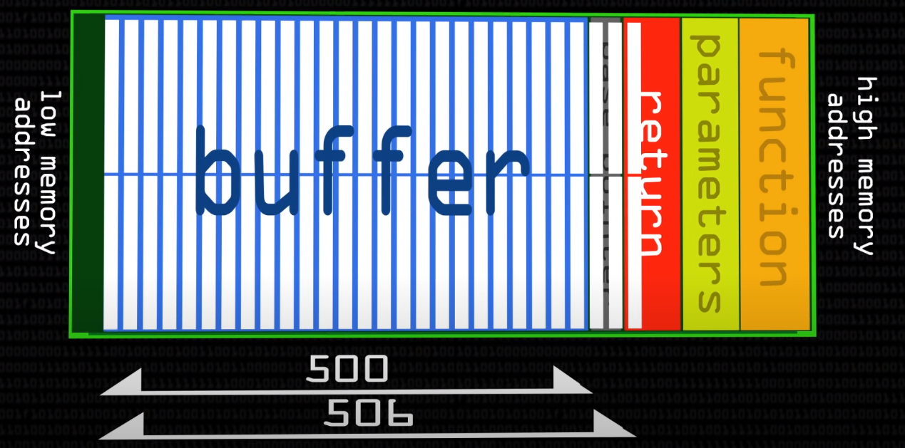
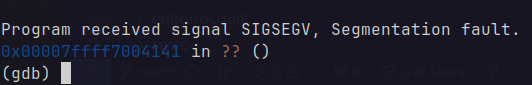
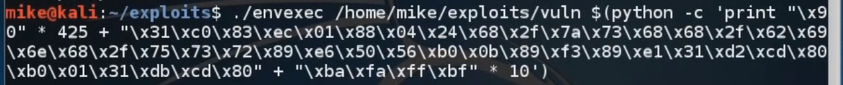
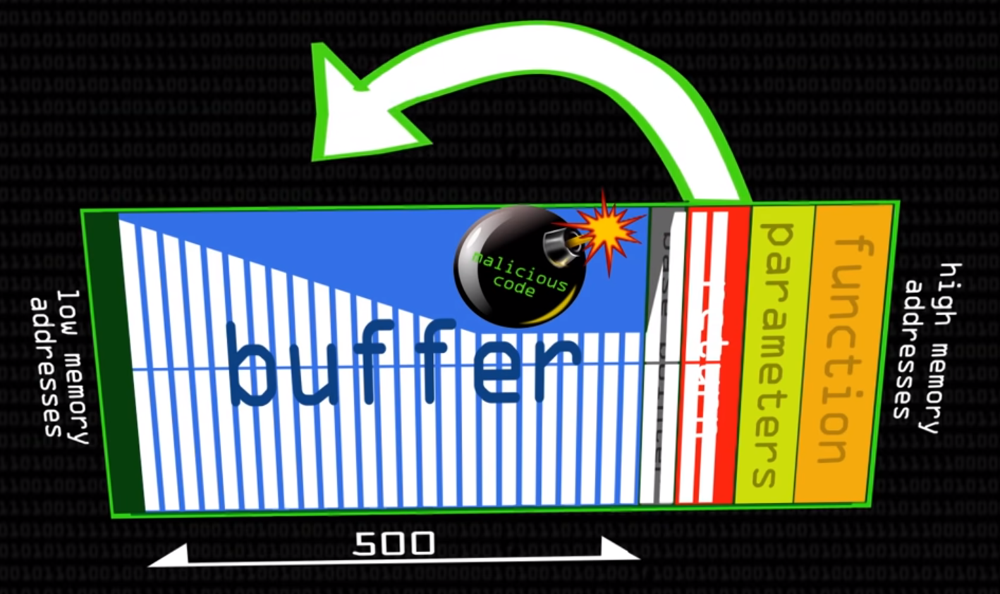

<!--markdownlint-disable MD033-->

# Buffer Overflow Attack

## Context

When program is runned by the OS, it is loaded into memory. The memory is divided into 4 segments:

- Code segment: contains the executable code
- Data segment: contains the global variables
- Heap segment: contains the dynamically allocated memory
- Stack segment: contains the local variables and the return address of the function

The stack is a LIFO data structure(Last In First Out). It is used to store the local variables and the **the return address of the function**. When a function is called, are pushed onto the stack (in order):

- local variables
- return address of the function called (the address of the next instruction to be executed after the function returns)
- Base pointer (BP)

When the function returns, the local variables are popped from the stack. The return address of the function is also pushed onto the stack. When the function returns, the return address is popped from the stack and the program **jumps to that address**.



If we could overwrite the return address of the function, we could make the program jump to a malicious code. This is called a **buffer overflow attack**.

## Vulnerable code

```c
#include <stdio.h>
#include <string.h>

int main(int argc, char *argv[]) {
    char buffer[500];
    strcpy(buffer, argv[1]);
    return 0;
}
```

As we can see, the program takes an argument and copies it into a buffer of 500 bytes. If the argument is longer than 500 bytes, the buffer will overflow and overwrite the return address of the function.

> How can it overwrite the return address fo the function if the allocation grows from the bottom to the top of the stack (= higher address to lower address) ?
> **Because when something is allocated in the RAM, it is growing from the bottom to the top of the stack !** That means that we will be able to overwrite the return address.

## Exploit

Let's first compile the code. For this you can use `make` in the root directory of the project. It will create a `main` executable.

If we executble a terminal `./main Hello`, under the hood, the OS will create a stack like this:



To see more in depth what's the stack looks like, we can use `gdb`:

```bash
gdb main
```

Then we can use the `disassemble` command to see the assembly code of the `main` function:

```bash
(gdb) disas main
```

Let's take a look at the assembly code and explain it to understand what's going on:

```assembly
endbr64
push   %rbp
mov    %rsp,%rbp
sub    $0x210,%rsp
mov    %edi,-0x204(%rbp)
mov    %rsi,-0x210(%rbp)
mov    -0x210(%rbp),%rax
add    $0x8,%rax
mov    (%rax),%rdx
lea    -0x200(%rbp),%rax
mov    %rdx,%rsi
mov    %rax,%rdi
call   0x1050 <strcpy@plt>
mov    $0x0,%eax
leave
ret
```

### Overflow the buffer

Let's first try to overflow the buffer with a simple string:

```bash
./main $(python -c 'print("\x41" * 505)')

*** stack smashing detected ***: terminated
zsh: IOT instruction (core dumped)  ./main $(python -c 'print("\x41" * 505)')

```



The buffer is overflowed and the program crashed.

### Find the return address

When debugging with `gdb`, you can run the program with the `run` command. When the program crashes, it tells you where it crashed. In our case, it crashed at the return address of the function:



We can see the 41s (A) that we put in the buffer. We can also see the return address of the function: `0x00007fffffffe1c8`. We can also see that the return address is 8 bytes long.

Now we just need to put some malicious code at the end of the buffer and overwrite the return address with the address of the malicious code.

### Malicious code



The malicious code (shellcode) is written in hexadecimal. It is a shellcode that will open a shell in root mode.



When executing ./main shellcode, we can see that the shellcode is executed by using the buffer overflow attack.

## References

- [Buffer Overflow Attack](https://www.youtube.com/watch?v=1S0aBV-Waeo)
